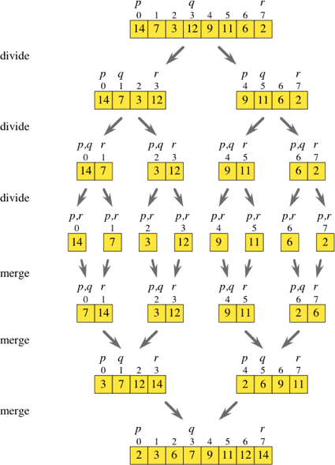

# [Merage Sort](https://www.jianshu.com/p/bb82dca89e2d)

merge sort 的核心理念是 Divide-and-conquer ，这个范式的核心是把问题分割成跟原问题相似的子问题，然后，递归的解决这些子问题，最后把这些子问题的结论合并得到原始问题的答案。Divide-and-conquer 分三步：

* Divide 把问题分割成跟原来的问题一致但是规模变小了的子问题。
* Conquer 递归的解决子问题。如果问题足够小了，直接解决子问题。
* Combine 把子问题的解决方案合并的到原问题的解决方案。

> 

> 动图过程：
> 
> 

